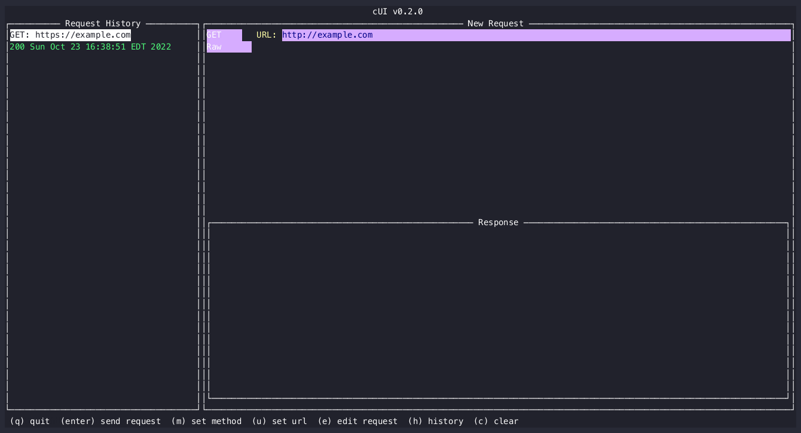

# cui

Stop building complex curl statements, use a terminal-based request editor.

## usage

Launch the application and along the bottom row you can see the keyboard
commands to interact with the interface.



### docker

If you don't want to build/install you can use the docker image the same
way that you would otherwise use the application.

```shell
docker run -it mfinelli/cui
```

### echo server

For local development you can launch the echo server which will just return
back the request that it received.

```shell
cui -server
```

## releases

Releases are automated, simply edit the version in `Dockerfile` and `main.go`,
and then make and push the relevant git tag.

### terminal video

The terminal video is make using [asciinema](https://asciinema.org):

```shell
asciinema rec cui.cast -c ./cui -t cui
agg cui.cast cui.gif
```

## license

```
cui: http request/response tui
Copyright 2022 Mario Finelli

This program is free software: you can redistribute it and/or modify
it under the terms of the GNU General Public License as published by
the Free Software Foundation, either version 3 of the License, or
(at your option) any later version.

This program is distributed in the hope that it will be useful,
but WITHOUT ANY WARRANTY; without even the implied warranty of
MERCHANTABILITY or FITNESS FOR A PARTICULAR PURPOSE.  See the
GNU General Public License for more details.

You should have received a copy of the GNU General Public License
along with this program.  If not, see <http://www.gnu.org/licenses/>.
```
